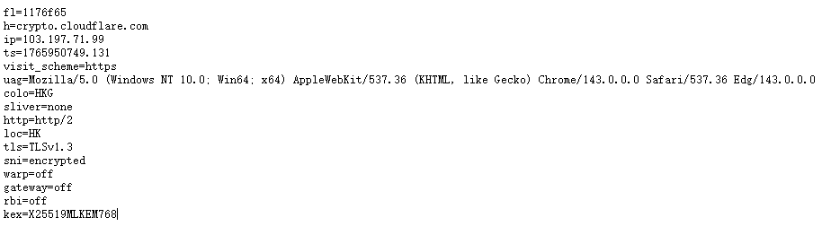
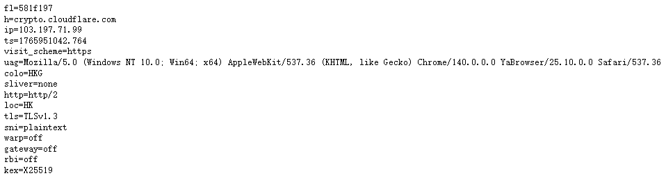

+++
date = '2025-12-16T15:59:56+08:00'
draft = false
title = '在校园网内进行网络加密'
tags = ["校园网", "加密"]  # 🔴 注意这里一定要用等于号 =
categories=["技术"]

+++

## 引用：

[SunBK201/UA3F: Advanced HTTP Header Rewriting Tool](https://github.com/SunBK201/UA3F)

## **前言：**

博主也是不幸中的不幸，开学初就因为科学上网被拉过去说教了。最近管的严确实没办法，但不魔法上网那还搞毛科研。现在要在共享了的前提下实现流量加密，来自由上网。

## **原理：**

上文提到用到的ua3f的插件是可以搭配shellcrash、openclash使用的，相比于以往的ua2f有更大的优势，也可以单独运行，不依赖任何代理。

按官方文档来看UA3F有5种不同的工作模式，其中HTTP和SOCKS5模式必须依赖clash才能够实现代理和改动UA。

### 那么现在有两套方案：

#### 一、节点部署在软路由上，一切代理与加密在软路由上执行。

#### 二、软路由只负责执行加密与分流，代理在客户端执行。

我自己目前用第一种方法，第二种方法有什么漏洞暂时未知。

## 泄露方式：

现代的网络加密其实已经做的很好了，现在大部分网站都用的https协议，没有任何中间人能够解密你的内容，实话来说，最能保护你隐私的其实是机场所有的协议，现在大部分机场也用的hy2、vless等协议了，如果还在用ss协议的朋友需要考虑换机场了。

### 那么校园网又是怎么判断我们的异常流量的呢？

#### **DNS泄露：**

打开自己的主路由看看自己的DNS服务器，在网上查一下，就会发现这是学校的DNS服务器。学校当然不知道我们数据包里面的内容，但是知道数据流去了哪里。

### SNI嗅探：

简单来说，它的作用是让客户端（如你的浏览器）在与服务器建立加密连接的“握手”阶段，就先行告知服务器：**“我要访问的具体域名是什么。”**那么在传统的tcp握手中，SNI信息是明文的，很容易被学校勘探到流量的去向。

### WEBRTC泄露：

浏览器需要进行实时性比较高的活动时，会向STUN服务器进行点对点的连接，也会泄露IP。

## 解决办法：

### 一、使用代理的DNS服务器

### 这里有两种方案：

第一种，如果正在用ua2f的小伙伴可以用mosdns来接管dns的流向，[sbwml/luci-app-mosdns: 一个 DNS 转发器 - OpenWrt 🎁 MosDNS v5 is Ready! 🎉](https://github.com/sbwml/luci-app-mosdns)软件下载在这里，教程也在里面，如果看不懂的话可以在评论区说一下，我会写一个手把手的教程。

第二种，用ua3f的小伙伴可以选择用shellcrash里自带的dns劫持来实现加密dns，只需在shellcrash的dns设置里找到加密dns就可以，当然也可以禁用shellcrash的dns劫持，让mosdns来接管。shellcrash搭配ua3f的yaml可以去官网找，也可以自己改写。

### shellcrash：[Releases · juewuy/ShellCrash](https://github.com/juewuy/ShellCrash/releases)[UA3F/docs/Clash.md at 

### UA3F: [UA3F/docs/Clash.md at master · SunBK201/UA3F](https://github.com/SunBK201/UA3F/blob/master/docs/Clash.md)

### 二、开启ECH来抵抗SNI嗅探：

#### **Chrome / Edge 浏览器：**

1. 在地址栏输入 `chrome://flags` (Edge 输入 `edge://flags`)。
2. 搜索 **"Encrypted Client Hello"**。
3. 将其状态设置为 **Enabled**。
4. **关键配套：** 必须开启浏览器自带的 **安全 DNS (DoH)**。
   - 进入“设置” -> “隐私和安全性” -> “安全性”。
   - 开启“使用安全 DNS”，选择“自定义”并填写 `https://1.1.1.1/dns-query` 或 `https://8.8.8.8/dns-query`。
   - *原理：ECH 需要从 DNS 的 HTTPS 记录中获取加密公钥，普通 DNS 无法提供，必须走 DoH。*

然后用[Cloudflare 浏览器检查 | Cloudflare](https://www.cloudflare.com/zh-cn/ssl/encrypted-sni/)来检测自己浏览器的安全性

有时候这个网站检测SNI有点问题，检测是否开启SNI以这个网站为准[crypto.cloudflare.com/cdn-cgi/trace](https://crypto.cloudflare.com/cdn-cgi/trace)

sni=encrypted即可，没有开启的就如下图。

### 三、WEBRTC

这个只需要在浏览器里安装插件WEBRTC CONTROL即可。[WebRTC Control - Microsoft Edge Addons](https://microsoftedge.microsoft.com/addons/detail/webrtc-control/eepeadgljpkkjpbfecfkijnnliikglpl?hl=zh-CN)

## 最后：

其实现代浏览器以及网站都已经把加密做的很好了，已经不像互联网早期那样了。校园网只能知道我们去了哪，但并不知道我们浏览的内容。最大程度上保密自己内容的是机场协议，vless和hy2是目前主流的协议，如果对保密有很强需求的同学可以用一些机场特有的协议。

PS:有小白需要手把手教程的话欢迎在评论区留言。
