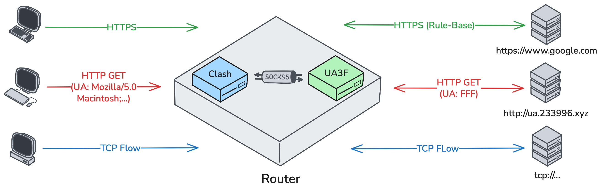

+++
date = '2025-12-16T15:59:56+08:00'
draft = true
title = '在校园网内进行网络加密'
tags = ["校园网", "加密"]  # 🔴 注意这里一定要用等于号 =
categories=["技术"]

+++

## 引用：

[SunBK201/UA3F: Advanced HTTP Header Rewriting Tool](https://github.com/SunBK201/UA3F)

## **前言：**

博主也是不幸中的不幸，开学初就因为科学上网被拉过去说教了。最近管的严确实没办法，但不魔法上网那还搞毛科研。现在要在共享了的前提下实现流量加密，来自由上网。

## **原理：**

上文提到用到的ua3f的插件是可以搭配shellcrash、openclash使用的，相比于以往的ua2f有更大的优势，也可以单独运行，不依赖任何代理。

按官方文档来看UA3F有5种不同的工作模式，其中HTTP和SOCKS5模式必须依赖clash才能够实现代理和改动UA。

那么

