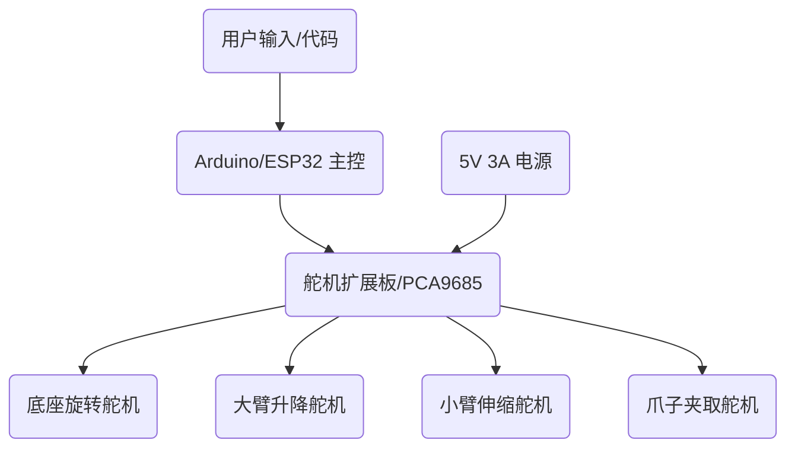

+++
date = '2025-12-23T19:23:52+08:00'
draft = true
title = '机械臂'
+++
# 4自由度桌面机械臂从零开始计划书

## 1. 技术架构预览

本方案推荐使用 **Arduino UNO** 或 **ESP32** 作为主控，使用 **SG90 或 MG90S 舵机** 驱动。

## 2. 硬件清单 (初学者推荐)

| 类别 | 推荐组件 | 备注 |
| :--- | :--- | :--- |
| **控制器** | Arduino UNO R3 或 ESP32 DevKit | ESP32 支持 WiFi/蓝牙，更具扩展性 |
| **驱动器** | PCA9685 16路舵机驱动模块 | 避免直接从开发板取电导致重启 |
| **执行器** | MG90S 金属齿轮舵机 (4个) | 力量比塑料齿轮的 SG90 更大，更稳定 |
| **结构件** | 亚克力切割件 或 3D 打印件 | 淘宝有成熟的 "meArm" 散件套组 |
| **电源** | 5V 3A 直流电源适配器 | 舵机群峰值电流较大 |
| **其他** | 杜邦线、面包板、螺丝刀 | 基本组装工具 |

## 3. 核心步骤拆解

### 第一阶段：准备与学习
- 学习 **PWM (脉冲宽度调制)** 原理，这是控制舵机的基础。
- 学习 Arduino 基础语法（`setup()`, `loop()`）。

### 第二阶段：结构组装
- 建议购买一套 **meArm 亚克力散件**。它是开源的，教程非常丰富。
- 注意：组装前先用程序将舵机“归位”（即设置到 90 度中位），否则装好后可能角度受限导致烧毁舵机。

### 第三阶段：代码实现
1. **单舵机控制**：让一个舵机从 0 度转到 180 度。
2. **多舵机联动**：通过串口监视器输入角度，控制四个舵机分别动作。
3. **动作序列记录**：编写一个简单的“录制”程序，记录一系列角度，让机械臂重复搬运。

## 4. 后续进阶方向
- **逆运动学 (IK)**：输入坐标 (x, y, z)，代码自动计算各关节角度。
- **视觉控制**：增加摄像头（结合 OpenCV）实现自动识别颜色并抓取。

---
**您是否同意此方案？如果同意，我将把任务移交给 [Code 模式] 来帮助你编写初始的舵机测试代码。**
