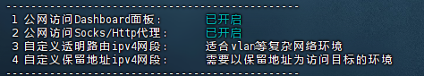

+++
date = '2025-12-29T13:00:47+08:00'
draft = false
title = '校园网创建隧道实现伪免认证上网以及加密流量'
tags = ["校园网", "共享","隧道","免认证"]
categories=["技术"]

+++

# 前言：

桂工校园网是没有做隔离的，也就是说整个学校是一个超大的校园网，即便不需要认证账号，你只需知道一个ip地址就可以全校访问，每个学校的AP下的ip分配是根据mac地址进行分配的，只要mac地址不变那么就是一个静态的ip.

# 原理：

也就是通过学校的ap，将流量通过校园网走你宿舍的软路由到外网，即保证了流量安全以及可以共享.

# 实践：

那么就很简单啦，我们只需要下一个shellcrash，配置公网访问的端口和密钥

找到你的软路由的ip地址，使用代理软件或者手机设置设置代理，ip:端口，输入用户名和密码，连接glut的网络，不需要认证，就可以实现上网了.

# 弊端：

但一旦ip地址泄露后，群众中有坏人的话就很容易受攻击，我也觉得这也是校园网很大的一个安全问题.